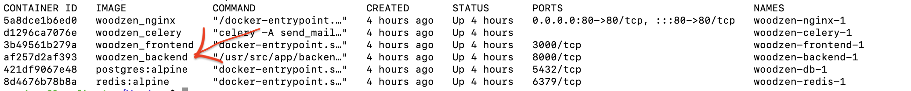

# Как развернуть docker container на VDS

## Задание переменных окружения


1. В ./backend в файле .env.dev указать переменные для входа в почту (предварительно настроить yandex почту для доступа приложений) и указать email для получения письм о заказе, также указать HOST и PROTOCOL

2. В ./frontend/src в файле env.ts указать имя домена и протокол


## Сборка production build

1. Установить npm пакет

2. В ./frontend установить все библиотеки командой ```npm install```

3. Собрать production build командой ```npm run build ```


## Запуск контейнера
Предварительно установить docker и docker-compose

1. Выполнить команду   ```docker-compose bild```

2. Запустить проект командой ```docker-compose up -d```

## Создание super user для админки

1. Выполняем команду чтобы посмотреть CONTAINER_ID контейнера с бэкендом ```docker ps```



2. Входим в bash контейнера ```docker exec -it <CONTAINER_ID> bash```

3. Выполняем команду ```python3 manage.py createsuperuser```

4. Заполняем все требующиеся поля

